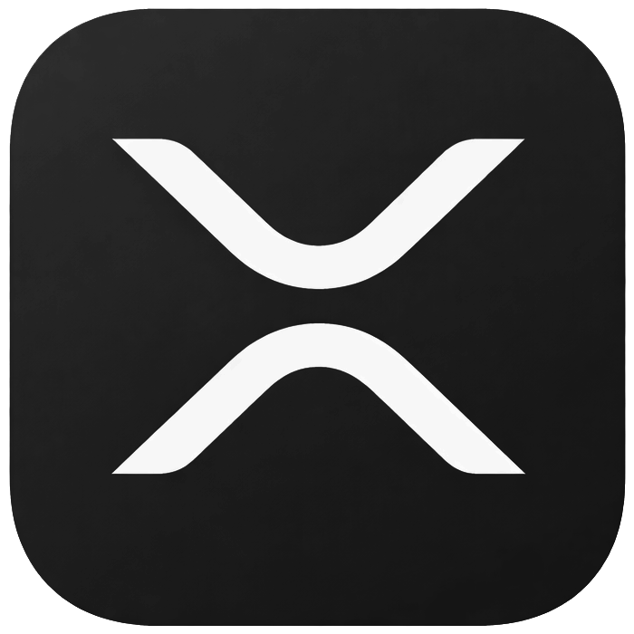
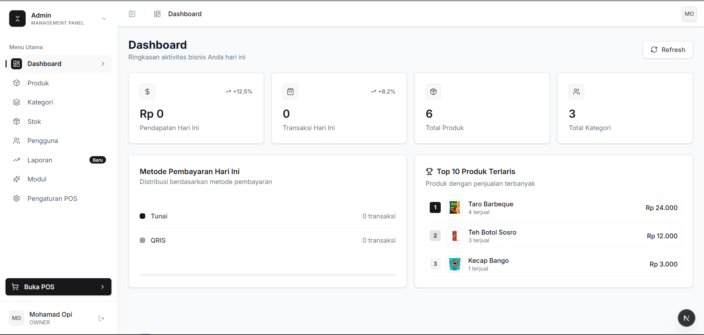

<div align="center">
  
  <p>X-Resource Planning</p>
</div>


# XRP - X-Resource Planning

(in development)

## Screenshot



## Tech Stack

### Backend
- **Go** - Programming language
- **Fiber** - Web framework
- **GORM** - ORM
- **PostgreSQL** - Database
- **JWT** - Authentication
- **Viper** - Configuration management
- **Logrus** - Logging

### Frontend
- **Next.js 16** - React framework
- **React 19** - UI library
- **TypeScript** - Type safety
- **Tailwind CSS 4** - Styling
- **shadcn/ui** - UI components (built on Radix UI)
- **Radix UI** - Headless UI components
- **Zustand** - State management
- **Axios** - HTTP client
- **Recharts** - Charts and visualizations
- **Lucide React** - Icons
- **date-fns** - Date utilities
- **Sonner** - Toast notifications

## Getting Started

### Prerequisites
- Go 1.21+
- Node.js 18+
- PostgreSQL 15+

### Backend Setup

1. Navigate to backend directory:
```bash
cd backend
```

2. Copy environment file:
```bash
cp .env.example .env
```

3. Edit `.env` with your database credentials

4. Install dependencies:
```bash
go mod download
```

5. Run database migrations and seed default owner:
```bash
go run cmd/migrate/main.go
```
*Note: This will automatically create an owner account (`admin@admin.com` / `admin123`) if no owner exists.*

6. Run the server:
```bash
go run main.go
```

The API will be available at `http://localhost:4001`

### Frontend Setup

1. Navigate to the project root (where package.json is located):
```bash
cd .
```

2. Install dependencies:
```bash
npm install
```

3. Run the development server:
```bash
npm run dev
```

The app will be available at `http://localhost:4000`


## License

MIT
